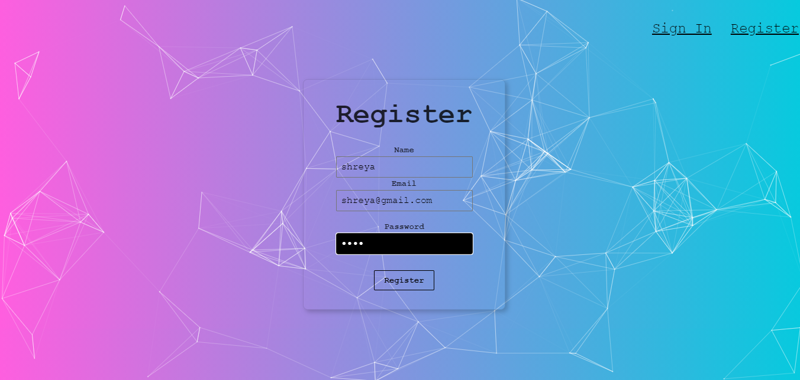
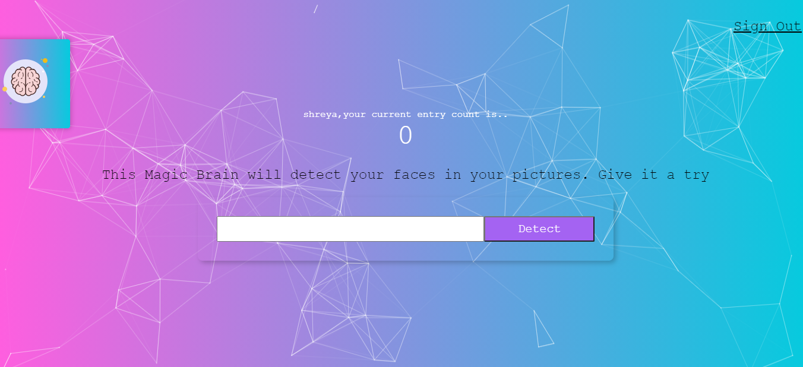
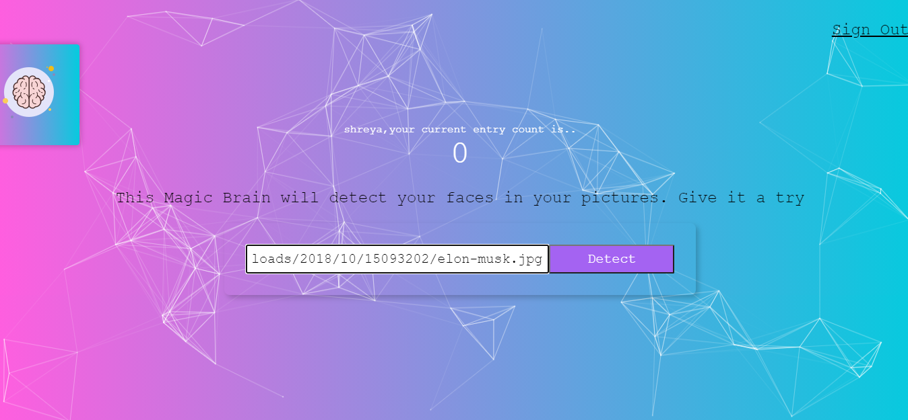
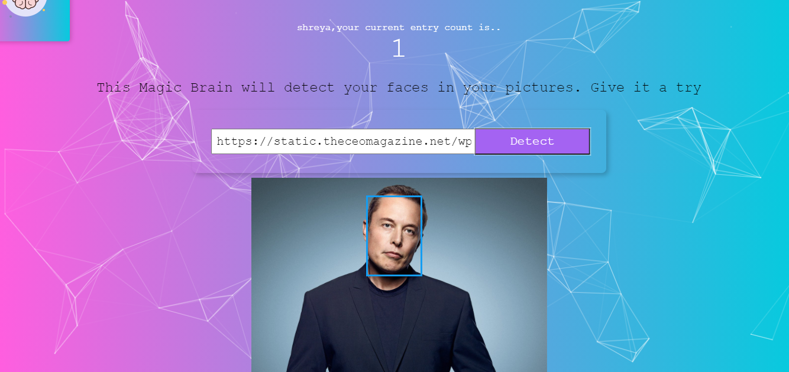

# SmartBrain Frontend
This is a react webapp to detect faces from image URLs.It supports user registration and sign in. Individual user profile is created which maintains the count of image URLs submission. The backend implenmentaion for this project  can be found here - https://github.com/shreya750/faceRecognition-backend
## Live Demo - https://smartbrainface-recognition.herokuapp.com/

## Technologies used - 
### FrontEnd - 
* #### React
* #### JSX
* #### CSS
* #### JavaScript

## Sample Images
* ### Sign In Page

* ### Register Page

* ### Home Page

* ### Image URL Input

* ### Face Detection Page

